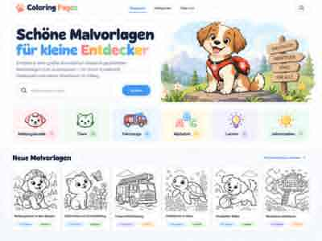

# UI Mockups

These images are the visual reference for the first HTML/CSS implementation.

They are **design references, not production assets**. The implementation should reproduce the layout system, hierarchy, spacing, responsive behavior and interaction priorities with real HTML/CSS rather than slicing the mockup images.

The repository contains compact JPEG reference copies so the planning branch stays lightweight. They are sufficient for implementation guidance; production UI must be built from HTML/CSS and real catalog assets.

## Overview exploration

`00-overview-collage.jpg` — earlier combined exploration showing home, mobile, detail, filters/search and print ideas.


## Desktop home

`01-desktop-home.jpg` — desktop home-page target.



## Mobile home

`02-mobile-home.jpg` — mobile home-page target.


## Print view

`03-print-view.jpg` — dedicated A4 print screen.


## Coloring-page detail

`04-coloring-detail.jpg` — coloring-page detail screen after opening an item.


## Implementation split

Suggested page/component structure:

```text
<header>
  brand
  desktop navigation
  mobile menu trigger
  search trigger
</header>

<main>
  home:
    hero
    search
    categories
    latest coloring cards

  detail:
    breadcrumb
    preview gallery
    metadata
    actions
    print/download info

  print:
    print toolbar
    A4 preview
</main>
```

Suggested CSS areas:

```text
tokens.css        colors, spacing, radius, typography
base.css          reset and shared elements
header.css        site header / navigation
hero.css          home hero
categories.css    category cards
gallery.css       coloring cards
detail.css        detail page
print.css         print view + @media print
responsive.css    breakpoints
```

V1 can start with fewer CSS files and split only when useful.

## Responsive intent

### Mobile

- 2 category/cards columns where practical
- large tap targets
- compact navigation
- search remains prominent
- primary print/download actions stay easy to reach

### Desktop

- wide hero
- category row/grid
- 4–6 coloring cards per row depending on viewport
- large preview + metadata/action column on detail page

## Priority

The mockups are a direction, not a requirement to copy every decorative detail.

Preserve:

1. simple navigation
2. strong search
3. easy category browsing
4. large coloring previews
5. highly visible **A4 drucken** action
6. clean mobile layout
7. fast static implementation
